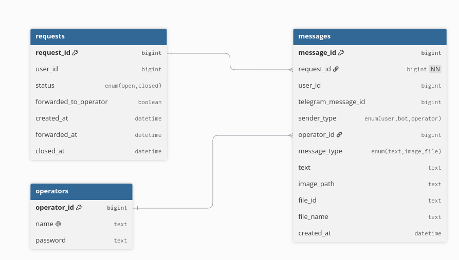

# Как запустить

Склонировать репозиторий. Скопировать файл `.env.example` и назвать его `.env`, указать `TELEGRAM_BOT_TOKEN` и `OLLAMA_API_KEY`. После чего выполнить из корня репозитория

```sh
cd promo-support_bot
docker compose up
```

На страница http://localhost:8000 можно будет авторизоваться с помощью логина и пароля `admin`, `admin`. Это пользователь для тестирования и он создаётся автоматически.

# Промпты, файлы

Относительно корня репозитория


Системный промпт и правила акции: `promo-support_bot/resources/prompts`

CLAUDE.md: `promo-support_bot/CLAUDE.md`

Прогон по тестовым случаям: `requests_answers.md`

Экспорты сессий: `exports`

# Допущения

- При любой проблеме которая не описана в инструкции или когда пользователь не пишет вопрос напрямую обращение переходит оператору. Это сделано чтобы бот не расписывал от своего лица советы/действия которые могли бы навредить имиджу компании.
- В веб-панели показываются только изображения и файлы. Поддержки голосовых/видео/стикеров нет. Это сделано по причине сложности извлечения текста из звука и потому что поддержка подобного рода сообщений не была прописана в ТЗ
- Статистика отображается в виде отдельного окна в панели (всплывающее окно), при этом расчёт метрик происходит на момент клика оператором на данную кнопку. Это сделано по причине того, что на практике чтение подобного рода данных через интерфейс нужно не очень часто.
- Окно с чатом обновляется в режиме реального времени с помощью технологии WebSockets (Reverb в PHP Laravel). Это сделано для того, чтобы оператору не нужно было регулярно обновлять страницу для получения новых сообщений от клиента.
- Сделана поддержка уточняющих вопросов (например когда пользователь не написал какой-либо конкретный вопрос бот попросит уточнить запрос). Это сделано для ситуаций когда пользователь делает приветствие в качестве отдельного сообщения, чтобы не повышать нагрузку операторов для обработки обычных "Здравствуйте" и "Привет".
- Используется API Ollama для запросов LLM. Используется модель gemma4:31b так как данная модель бесплатная и показывает хороший результат для данной задачи.

# Схема базы данных



Используется отношение один ко многим для обращений и сообщений к ним. Также присутствует вся необходимая информация для расчёта необходимой статистики. Помечается кем сделано сообщение (при этом указывается какой оператор писал сообщение), теоретически несколько операторов могут одновременно работать над одним обращением.

# Известные проблемы

- Бот всегда пишет "Здравствуйте" в начале сообщения, даже если пользователь обращается не в первый раз.
- При любой проблеме бот выводит заранее готовое сообщение с просьбой подождать оператора, при этом каких-либо дополнительных комментариев от бота не даётся, даже если он может дополнить сообщение в соответствии с правилами.
- При обращении к LLM нет лимита на выходные токены. Если пользователь активирует глубокие размышления у модели по какой-либо причине токенов может потратиться в разы больше чем обычно. Но при этом если неправильно подобрать золотую середину операторам достанется больше сообщений которые мог обработать бот.
- Бот не может сделать ссылки для файлов больших размеров (больше 20 МБ) из-за ограничений Telegram CDN. Файлы не сохраняются локально на сервер для экономии места, вместо этого генерируется ссылка на файл с помощью getFile в Telegram, для сокрытия токена бота используется Proxy на Backend'е.
- В редких случаях было замечено что Reverb не всегда хорошо подхватывается в диалоговом окне для авто-обновлений чата. Проблема решается с помощью единоразового обновления страницы.
- Нет отдельного сообщения во время генерации ответа LLM. Если генерация ответа затянется (больше 10 секунд) пользователь может подумать что бот завис. С API Ollama на практике время ожидания генерации ответа не превышало 2-3 с. 

# Перез запуском в продакшен

- Настроить все секреты в .env файле (в основном логин и пароль от базы данных PostgreSQL)
- Настроить маршрутизацию с учётом домена (HTTPS, сертификаты SSL)
- Провести небольшой аудит безопасности на проблему утечек секретов, доступа к сервисам, уязвимостей. Либо с помощью агентов (Claude Code), либо вручную со средствами для аудита безопасности сайтов написанных на Laravel.
- Убрать создание тестового пользователя `admin:admin`
